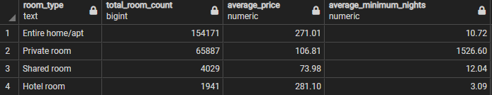
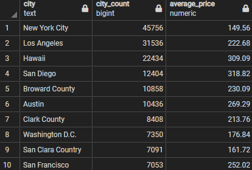
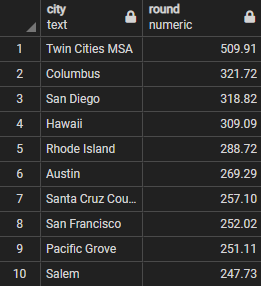

# ETL PROJECT: Jillian Nemec & Celine Villareal

Using APIs from Kaggle, this project will use the ETL (extract, transform, and load) procedure to analyze Airbnb data from Chicago and other U.S. cities.

## Source Data
* [U.S Airbnb Listings](https://www.kaggle.com/kritikseth/us-airbnb-open-data)
* [Chicago Airbnb Listings](https://www.kaggle.com/jinbonnie/chicago-airbnb-open-data/version/1)

Data files used in this project:

<b>listings.csv:</b> This file contains data from Chicago about the Airbnb host, listings, property information, price, and minimum number of nights allowed. 
<b>AB_US_2020.csv:</b> This file contains data from U.S.cities about the Airbnb host, listings, property information, price, and minimum number of nights allowed.

## Data Cleanup and Analysis

### Extraction 
This project used two datasets from Kaggle, a public API platform, which highlight Airbnb data from the city of Chicago and major U.S. cities. Both datasets were archived in a .csv format and were the most recent datasets available. Chicago data was collected between 2014 – 2020, while U.S. data was collected between 2018 – 2020. Both datasets contain the following information:
*	Airbnb host ID
*	Listings and property information
*	Price
*	Minimum number of nights allowed per booking

### Transformation 
Both .csv files were loaded into separate pandas data frames in order to clean and transform the datasets before filtering. A copy of each of the data frames was created to save the original, untouched dataset. 

The next step was to remove duplicate values and drop unfilled rows to create a dataframe ready to load into Postgres.

### Load 
Both datasets were transferred to the local PostgreSQL database via SQLAlchemy. Before transferring the data to PostgreSQL, respective tables were created in PostgreSQL to match the columns from the final pandas data frames. After creating the tables, the data was transferred to PostgreSQL, a relational database, via a created connection. The data frame information was transferred to each respective SQL table. 

Once the data was loaded onto PostgreSQL, we were able to perform multiple queries to filter desired criterion. Criterion were saved into table views to save queries of data for fast reference. For example, the Chicago and U.S. data were joined into a view table called ‘joined_tables’ on primary key id.

## Extract, Transform, Load 

* Download csv files from datasource and push to github.
* Add a new database to Postgres.  

* Import pandas and sqlalchemy in Jupyter notebook. 

* Read the datafiles in Jupyter using read_csv. 

* Clean the data and create relevant dataframes. 
 

* Connect engine to postgres. 

* Push tables to sql using to_sql. 

* After loading the data into a Postgres database, we could view our tables and create views based on what we were looking for. 
 
The airbnb_db includes two tables, chicago and usa, and four views. 
* The final tables or collections that will be used in the production database. 
     
    While hotel rooms have the highest average price in Chicago, entire home/apt rentals take the lead in total listings.  

     

     

     

     

 
 
 

